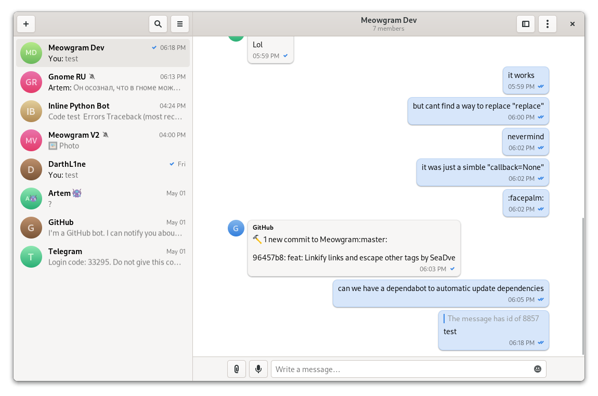

<h1 align="center">
  <br>
  Meowgram
</h1>

<p align="center"><strong>Telegram client written in GTK & Python</strong></p>

<br>
<p align="center">
  <a href="https://github.com/ExposedCat/Meowgram/actions/workflows/testing.yml">
    
  </a>
</p>

<p align="center">
  
</p>

## 🐱 Why Meogram?
Meowgram = Meow + Gram :D  
**Meow** - Talking cats sound. It's a symbol of unique and user friendly UI of client, just like a cute kitten.  
**Gram** - Part of platform name: Telegram. It says about which messanger is client made for.  


## 🏗️ Building from source

### GNOME Builder
GNOME Builder is the environment used for developing this application. 
It can use Flatpak manifests to create a consistent building and running 
environment cross-distro. Thus, it is highly recommended you use it.

1. Download [GNOME Builder](https://flathub.org/apps/details/org.gnome.Builder).
2. In Builder, click the "Clone Repository" button at the bottom, using `https://github.com/ExposedCat/Meowgram.git` as the URL.
3. Click the build button at the top once the project is loaded.

### Meson
```
git clone https://github.com/ExposedCat/Meowgram.git
cd Meowgram
meson builddir --prefix=/usr/local
ninja -C builddir install
```
